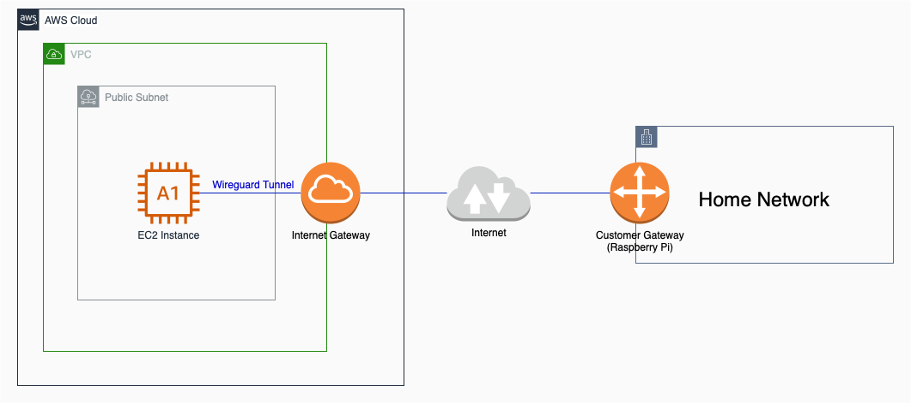
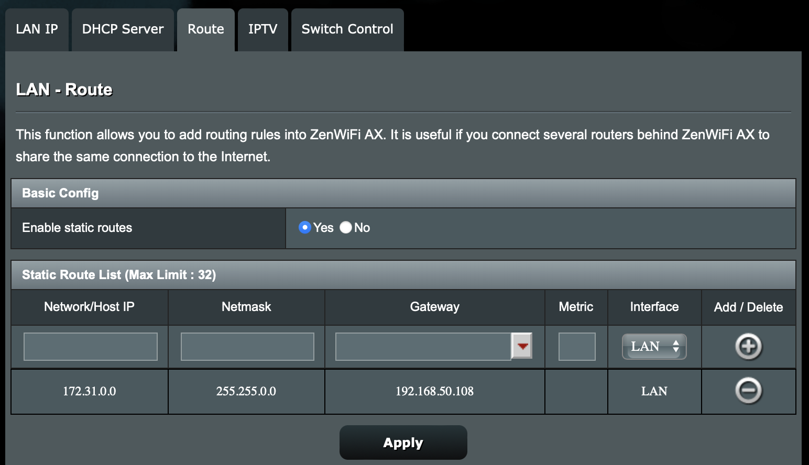
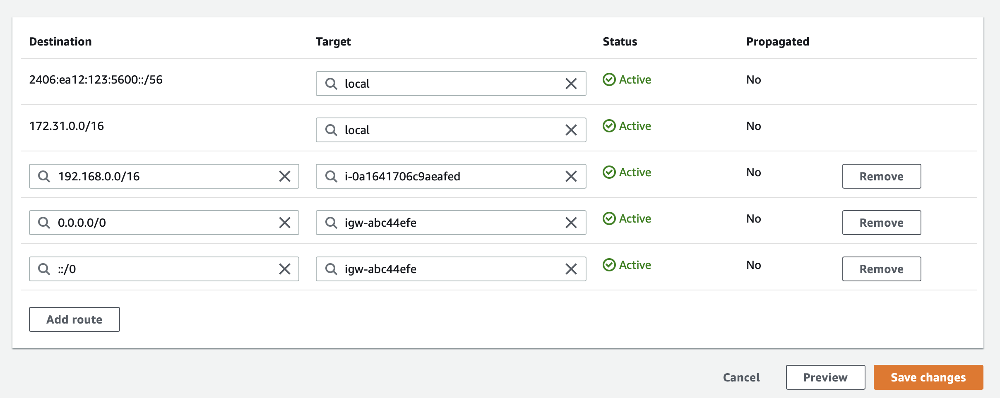

When setting up a VPC on my AWS account, I realized that it would be really useful if I was able to connect the VPC with my home network so that there could be a (secure) reverse proxy running on AWS that allows access to services one the home network remotely.

AWS offers managed services such as AWS Site-to-Site VPN that can build a tunnel between the VPC and a on-prem network but some quick calculations seemed to indicate that it would cost over $35 a month. I wanted something cheaper so started looking into setting up a VPN server on an EC2 `a1.medium` instance. Note that that this setup prioritizes cost savings over reliability (and probably shouldn't be used for any important services).

Wireguard kept coming up as the VPN protocol that's fast, not very resource-intensive, and it seemed simple enough to set up. Here's a simple architectural diagram of this setup:



The objective here is for any device in the AWS VPC (on the `172.31.0.0/16` subnet) to have the ability to communicate with any device on the home network (on the `192.168.50.0/24` subnet) and vice-versa.

Here I'm using a Raspberry Pi (running Raspbian OS) as the "VPN gateway" on the home network side and the EC2 instance is the gateway on the AWS side.

On AWS, an EC2 instance (`m1.medium`) with an Ubuntu Server 20.04 AMI is spun up (on a public subnet, which has access to an Internet gateway). When creating the instance, the security group is modified so that UDP traffic on port `51820` is allowed in the ingress rules from the home network. When the instance is ready, we can SSH into it and install Wireguard.

```shell
$ sudo apt update
$ sudo apt install wireguard
Reading package lists... Done
Building dependency tree
Reading state information... Done
The following additional packages will be installed:
  wireguard-tools
Suggested packages:
  openresolv | resolvconf
The following NEW packages will be installed:
  wireguard wireguard-tools
0 upgraded, 2 newly installed, 0 to remove and 40 not upgraded.
Need to get 89.5 kB of archives.
After this operation, 332 kB of additional disk space will be used.
Do you want to continue? [Y/n] y
```

Once installed, we can set up the private keys (and secure them) for use in the Wireguard config.

```shell
$ wg genkey | sudo tee /etc/wireguard/private.key
$ sudo chmod go= /etc/wireguard/private.key
```

The private key will be outputed here and will also be stored at `/etc/wireguard/private.key` for future reference. We will copy it for use in the Wireguard config. We'll also create the corresponding public key.

```shell
$ sudo cat /etc/wireguard/private.key | wg pubkey | sudo tee /etc/wireguard/public.key
```

We're now ready to create the Wireguard config for the server. We can create a new file at `/etc/wireguard/wg0.conf` (as root).

```editorconfig
[Interface]
PrivateKey = qDwowxI1K/2OodUdho2o_SERVER_PRIVATE_KEY_____
Address = 172.31.15.236/32
ListenPort = 51820

PostUp = iptables -t nat -A POSTROUTING -o ens5 -j MASQUERADE
PostDown = iptables -t nat -D POSTROUTING -o ens5 -j MASQUERADE

[Peer]
PublicKey = leave_blank_for_now_and_fill_later_with_client_public_key
AllowedIPs = 192.168.50.0/24
```

The private key here comes from the key we generated earlier. The address under the Interface section corresponds to the IP of the EC2 instance (here it is `172.31.15.236`). The peer's public key is still unavailable (we will generate it below). The allowed IPs of the peer is set to the subnet of the home network. In my case, I'd like to be able to access the entire `192.168.50.0/24` subnet, though you could limit it to a subset of the subnet.

In the `PostUp` and `PostDown` commands, the main interface will need to be replaced with your EC2 instance's main interface ID. You can find this from `ifconfig`.

Now, it's time to install Wireguard and follow the same steps to generate public/private key on the Raspberry Pi (Wireguard client).

```shell
$ sudo apt install wireguard
Reading package lists... Done
Building dependency tree
Reading state information... Done
The following additional packages will be installed:
  wireguard-tools
Suggested packages:
  openresolv | resolvconf
The following NEW packages will be installed:
  wireguard wireguard-tools
0 upgraded, 2 newly installed, 0 to remove and 40 not upgraded.
Need to get 89.5 kB of archives.
After this operation, 332 kB of additional disk space will be used.
Do you want to continue? [Y/n] y
```

After installation, we can generate the client's private/public keys.

```shell
$ wg genkey | sudo tee /etc/wireguard/private.key
$ sudo chmod go= /etc/wireguard/private.key
$ sudo cat /etc/wireguard/private.key | wg pubkey | sudo tee /etc/wireguard/public.key
```

The Raspberry Pi client's private and public keys are available here. We will copy the **public** key that's just been generated and go back to the Ubuntu server's Wireguard config file and replace the placeholder `leave_blank_for_now_and_fill_later_with_client_public_key` with this public key.

On the Raspberry Pi client, we can now set up the Wireguard config file (at `/etc/wireguard/wg0.conf`).

```editorconfig
[Interface]
Address = 192.168.50.106/32
PrivateKey = cPIqtQvMO5Ju+UD_CLIENT_PRIVATE_KEY

[Peer]
PublicKey = Kgpp0tDslgOoqEzTcDeNrov+hoTmYMf/hf2VtTqciRc=
Endpoint = ec2-wireguard.sidartha.xyz:51820
AllowedIPs = 172.31.0.0/16

PersistentKeepalive = 25
```

The address in the interface should reflect the private IP of the Pi within the home network. Also, you should try to configure your home router to reserve this IP for your Pi to avoid having to keep changing this. The private key comes from the client private key.

Under the peer section, we need to include the EC2 server's public key and its endpoint. The public key can be found on the server at `/etc/wireguard/public.key` and the endpoint (here `ec2-wireguard.sidartha.xyz`) is the hostname or IP address that you find from the EC2 console.

Now we're ready to start Wireguard on the server and the client. On **both** the server and the client, we execute

```
$ sudo wg-quick up wg0
```

This will start Wireguard on both the server and client.

We can now test connectivity by pinging the server from the client and vice-versa.

```shell
// From the server
$ ping 192.168.50.108
PING 192.168.50.108 (192.168.50.108) 56(84) bytes of data.
64 bytes from 192.168.50.108: icmp_seq=1 ttl=64 time=69.2 ms
64 bytes from 192.168.50.108: icmp_seq=2 ttl=64 time=66.4 ms
64 bytes from 192.168.50.108: icmp_seq=3 ttl=64 time=15.8 ms
64 bytes from 192.168.50.108: icmp_seq=4 ttl=64 time=15.7 ms

// From the client
$ ping 172.31.25.236
PING 172.31.25.236 (172.31.25.236) 56(84) bytes of data.
64 bytes from 172.31.25.236: icmp_seq=1 ttl=64 time=15.4 ms
64 bytes from 172.31.25.236: icmp_seq=2 ttl=64 time=16.2 ms
64 bytes from 172.31.25.236: icmp_seq=3 ttl=64 time=15.6 ms
64 bytes from 172.31.25.236: icmp_seq=4 ttl=64 time=16.7 ms
64 bytes from 172.31.25.236: icmp_seq=5 ttl=64 time=16.7 ms
```

I also ran into an issue where I needed to reduce the mtu to `1400` on the Raspberry Pi client (presumably because my Pi was using WiFi for connection to the home network and the mtu for the `wlan0` interface is `1500`)

```shell
$ sudo ifconfig wg0 mtu 1400
```

Now that Wireguard is running on both the server and client, to ensure connectivity from the entire home network to the AWS VPC, we need to add a static entry to the home router's route table to route all traffic destined for the AWS VPC subnet via the Raspberry Pi. The rule would ensure that all traffic bound for `172.16.0.0/16` is forwarded to `192.168.1.108` (the Pi). The exact terminology would differ from router to router, but here's a screenshot of how it can be done on the ASUS ZenWifi:



We will also do the same on the AWS subnets that we want to be routed. For the [route table(s)](https://console.aws.amazon.com/vpc/home?region=us-east-1#RouteTables:) associated with the subnets where you want to route to the home network, add the rule that all traffic bound for the home network (in this case `192.168.50.0/24`) is routed through the instance we created and installed Wireguard on.



Finally, we must modify the EC2 instance where we installed Wireguard to disable source/destination IP checks. Instructions are available on the [VPC User Guide](https://docs.aws.amazon.com/vpc/latest/userguide/VPC_NAT_Instance.html#EIP_Disable_SrcDestCheck). Since our Wireguard instance on EC2 is acting as a NAT instance, this NAT instance is able to send and receive traffic when the source/destination is not itself.

With this, we should have a setup where our entire VPC can communicate with our entire home network. 🎉
